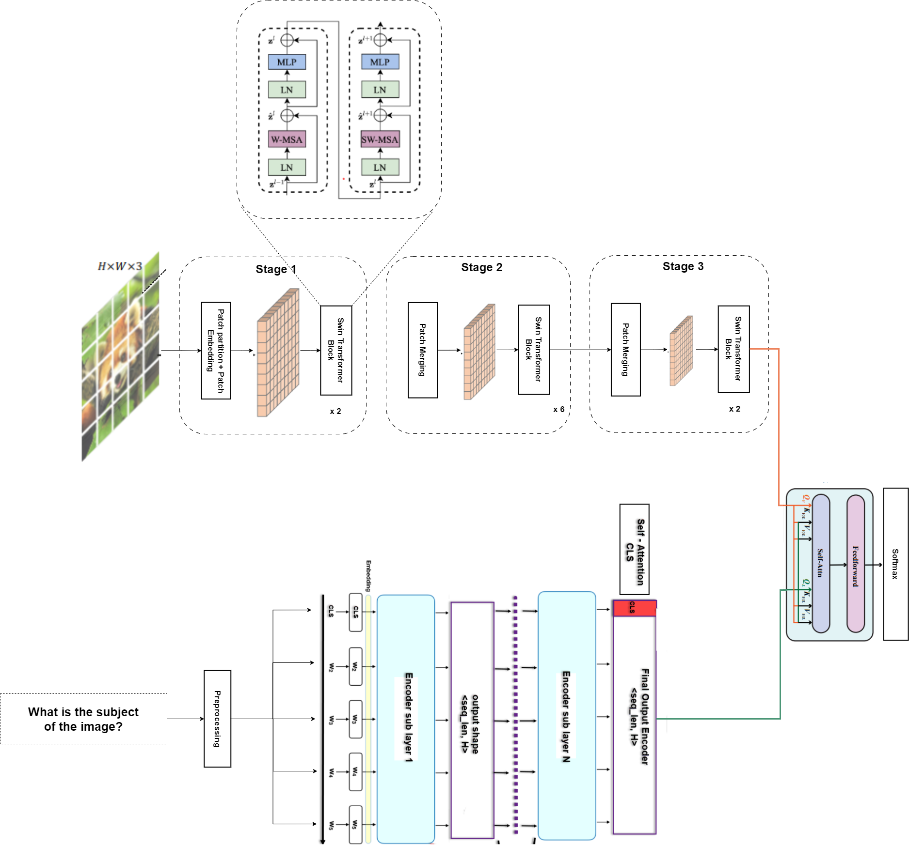
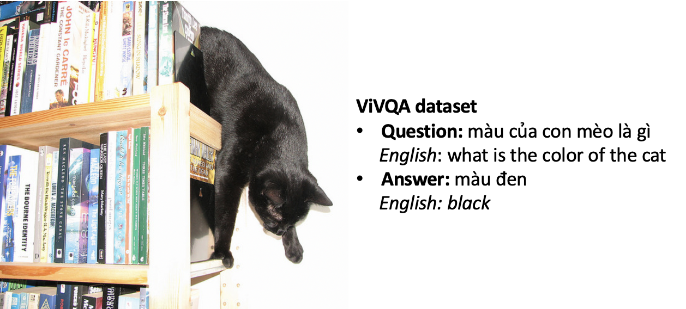
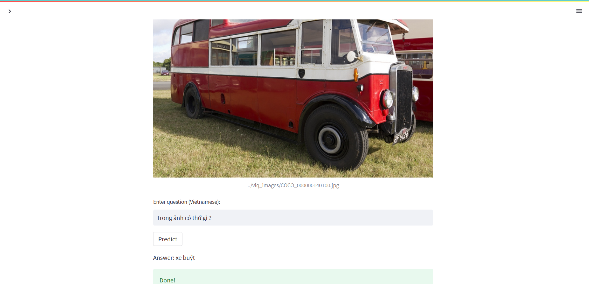

# Vietnamese Visual Question Answering

This is our Capstone Project (AIP491), which is carried out in the Spring 2023 Semester at FPT University.

**Overall view:** Although in English, there exist [foundation models](https://arxiv.org/abs/2111.11432) that can be transferred and achieve excellent performance in downstream tasks for language or multimodal tasks, those in Vietnamese are of little interest. Through our research on adapting the most advanced models for processing each type of data, we found and pointed out that to have a breakthrough in this domain, similarly, there must be a large and long-term investment in building foundation models in Vietnamese,  to take that as a first step for building exciting applications. 
 

## Model Architecture
In this project, we are concerned with attention-based models which proved effective in filtering the most relevant information for decision-making, instead of using the entire distribution of images or language. Some advanced image encoders we have adapted and fine-tuned are [Visual Attention Network](https://github.com/Visual-Attention-Network/VAN-Classification), [Swin Transformer](https://github.com/microsoft/Swin-Transformer), [CvT](https://github.com/microsoft/CvT) and [CLIP-ViT](https://github.com/zdou0830/METER), which were trained contrastively by [OpenAI](https://openai.com/) as a foundation for the multimodel task in English. Pretrained PhoBert was used as our text encoder. Fusion modules (including [co-attention module](https://arxiv.org/pdf/2111.11432.pdf) and [merge-attention module](https://arxiv.org/pdf/2111.11432.pdf) are also reasonably added during the data encoder process, facilitating the process of distilling important features for later decision-making.

Our proposed architecture is visualized in the image below:

## Dataset

[ViVQA dataset](https://github.com/kh4nh12/ViVQA) is used as the benchmark for our experiments, it's translated and refined from part of [COCO-QA dataset](https://www.cs.toronto.edu/~mren/research/imageqa/data/cocoqa/).
It consists of 10,328 images and 15,000 pairs of questions and answers in Vietnamese corresponding to the content of the images. We split the dataset randomly into training and test sets with a ratio of 8:2.

A sample in the ViVQA dataset:

## Experiments
Our experiment results is shown in table below:
Model | Acc | WUPS 0.9 | WUPS 0.0 |
--- | --- | --- | --- |
LSTM + W2V | 0.3228 | 0.4132 | 0.7389 |
LSTM + FastText | 0.3299 | 0.4182 | 0.7464 |
LSTM + EMLO | 0.3154 | 0.4114 | 0.7313 |
LSTM + PhoW2Vec | 0.3385 | 0.4318 | 0.7526 |
Bi-LSTM + W2V | 0.3125 | 0.4252 | 0.7563 |
Bi-LSTM + FastText | 0.3348 | 0.4268 | 0.7542 |
Bi-LSTM + ELMO | 0.3203 | 0.4247 | 0.7586 |
Bi-LSTM + PhoW2Vec | 0.3397 | 0.4215 | 0.7616 |
Co-attention + PhoW2Vec | 0.3496 | 0.4513 | 0.7786 |
CvT + PhoBert | 0.3805 | 0.5382 | 0.7943 |
Clip-Vit + PhoBert | 0.5227 | 0.5641 | 0.8308 |
Pretrained CNN (Visual Attention Network) + PhoBert | 0.5979 | 0.6157 | 0.8623 |
Swin Transformer + PhoBert | **0.6201** | **0.6814** | **0.8719** |

## Demo
For running demo:

`streamlit run demo.py`

## Authors
- [@hieultse150560](https://www.github.com/hieultse150560)
- [@daocongtuyen2x](https://www.github.com/daocongtuyen2x)

