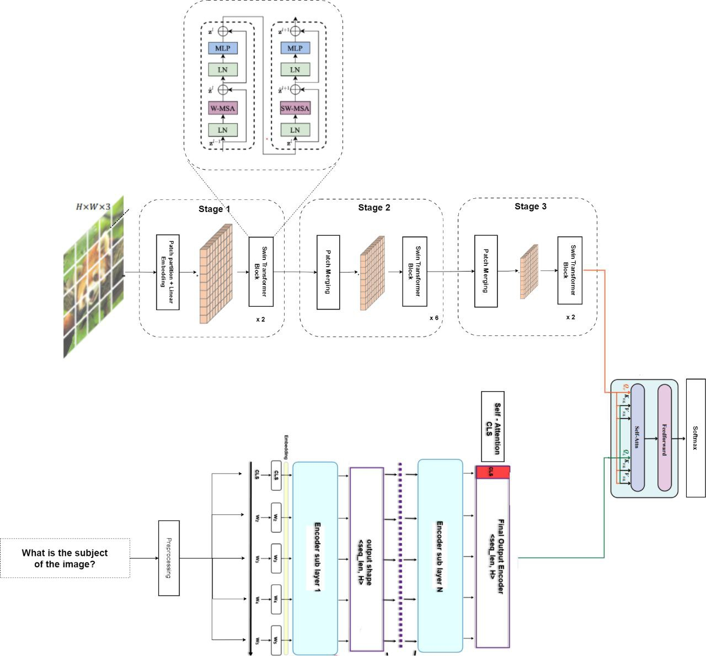

# Vietnamese Visual Question Answering

Final Capstone Project - AIP491 - Spring2023 - FPT University.

 

## Model Architecture
In this project, we use image encoders such as [CLIP-ViT](https://github.com/zdou0830/METER), [Swin Transformer](https://github.com/microsoft/Swin-Transformer), [Visual Attention Network](https://github.com/Visual-Attention-Network/VAN-Classification), [CvT](https://github.com/microsoft/CvT) and use PhoBert as text encoder. Our best architecture can be visualized in the image below:

## Dataset

We use [ViVQA dataset](https://github.com/kh4nh12/ViVQA)

ViVQA is a new dataset for evaluating Vietnamese VQA models. The ViVQA dataset consists of 10,328 images and 15,000 pairs of questions and answers in Vietnamese corresponding to the content of the images. We divide the dataset randomly into training and test sets with a ratio of 8:2.

Sample in ViVQA dataset:

## Experiments
Our experiment results is included in above table:
Model | Acc | WUPS 0.9 | WUPS 0.0 |
--- | --- | --- | --- |
LSTM + W2V | 0.3228 | 0.4132 | 0.7389 |
LSTM + FastText | 0.3299 | 0.4182 | 0.7464 |
LSTM + EMLO | 0.3154 | 0.4114 | 0.7313 |
LSTM + PhoW2Vec | 0.3385 | 0.4318 | 0.7526 |
Bi-LSTM + W2V | 0.3125 | 0.4252 | 0.7563 |
Bi-LSTM + FastText | 0.3348 | 0.4268 | 0.7542 |
Bi-LSTM + ELMO | 0.3203 | 0.4247 | 0.7586 |
Bi-LSTM + PhoW2Vec | 0.3397 | 0.4215 | 0.7616 |
Co-attention + PhoW2Vec | 0.3496 | 0.4513 | 0.7786 |
Clip-Vit + PhoBert | 0.5227 | 0.5641 | 0.8308 |
Pretrained CNN (Visual Attention Network) + PhoBert | 0.5979 | 0.6157 | 0.8623 |
Swin Transformer + PhoBert | **0.6201** | **0.6814** | **0.8719** |

## Demo

Simple streamlit app demo, after download weight, run demo:

`streamlit run demo.py`

## Authors
- [@hieultse150560](https://www.github.com/hieultse150560)
- [@daocongtuyen2x](https://www.github.com/daocongtuyen2x)

